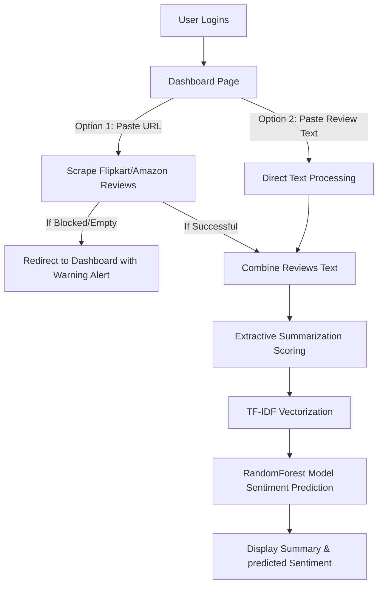

# Review Insight - Sentiment Analyzer & Summarizer

Review Insight is a professional Django-based web application that automates the extraction, summarization, and sentiment classification of product reviews. The system takes product reviews (either by scraping Amazon/Flipkart product review pages or via direct copy-pasted text), extracts key summary sentences, and predicts the overall customer sentiment using a pre-trained Random Forest Classifier.

---

## 📂 Project Structure

The codebase is organized cleanly with professional naming conventions:

```text
├── core/                   # Main Django configuration directory (settings, urls, wsgi)
├── analyzer/               # Django application folder containing core logic
│   ├── migrations/         # Database migrations
│   ├── templates/          # HTML templates (index, result, login, register, etc.)
│   ├── apps.py             # Application configuration
│   ├── forms.py            # User registration/authentication forms
│   ├── urls.py             # Routing rules for the analyzer app
│   └── views.py            # Main logic for text processing, scraping, and prediction
├── db.sqlite3              # Local SQLite database containing user profiles
├── manage.py               # Django command-line utility
├── random_forest_model.sav # Serialized RandomForestClassifier model
└── reviews_dataset.csv     # Reference dataset used to fit the TF-IDF Vectorizer
```

---

## 🛠️ Key Features

1. **Dual input processing**:
   - **Real-Time URL Scraping**: Automatically parses and extracts reviews from Flipkart and Amazon product review URLs.
   - **Direct Raw Text Analysis**: Allows copy-pasting review text directly to bypass potential automated scraper blocking or captcha walls.
2. **Extractive Text Summarization**: Custom frequency-based scoring of sentence-tokens using `nltk` to extract the most representative sentences.
3. **Sentiment Classification**: Vectorizes text using a fitted TF-IDF pipeline and runs predictions through a Random Forest Classifier to label sentiment as **Positive** or **Negative**.
4. **Graceful Error Handling**: Detects anti-scraping blocks or empty inputs and provides visual Bootstrap feedback to the user on the dashboard rather than raising server-side crashes.
5. **Secure Authentication**: Built-in Django user registration, login session tracking, and protected endpoints.

---

## ⚙️ Setup and Installation

### 1. Prerequisites
Ensure you have Python 3.11+ installed.

### 2. Configure Virtual Environment
Create and activate a virtual environment, then install the required libraries. 

> [!IMPORTANT]
> The pre-trained model file (`random_forest_model.sav`) was compiled with a specific scikit-learn version. To prevent unpickling errors, make sure you install the exact compatible packages:

```bash
# Create a virtual environment
python -m venv venv

# Activate virtual environment
# On Windows:
.\venv\Scripts\activate
# On macOS/Linux:
source venv/bin/activate

# Install dependencies
pip install scikit-learn==1.2.2 numpy==1.26.4 django pandas beautifulsoup4 nltk lxml textblob matplotlib seaborn
```

### 3. Setup NLTK Resources
Run Python and download the required NLTK tokenizers and stopwords datasets:

```python
import nltk
nltk.download('punkt')
nltk.download('stopwords')
```

### 4. Run System Checks & Start Server
Run Django verification checks and start the development server:

```bash
# Perform system check
python manage.py check

# Run the development server
python manage.py runserver
```

Open your browser and navigate to `http://127.0.0.1:8000/`.

---

## 💡 Usage Workflow



1. **Sign In**: Log in using your registered credentials (e.g., test username: `suraj`, password: `password123`).
2. **Submit Input**: Paste an Amazon/Flipkart review URL or copy-paste review paragraphs directly.
3. **Review Results**: The system will redirect to the results page displaying the extracted summary sentences and the predicted sentiment.
