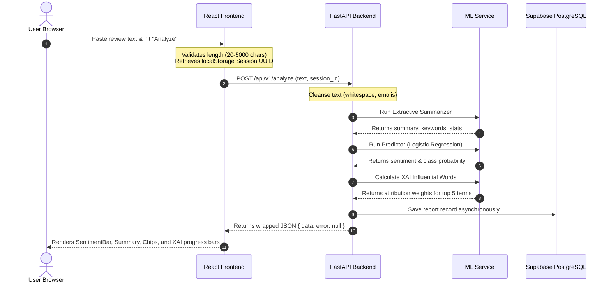

# ReviewLens — Explainable AI Sentiment & Summarizer

> **Live Demo:** [https://reviewlens.vercel.app](https://reviewlens.vercel.app) *(Placeholder)*
> **Backend API:** [https://reviewlens-api.onrender.com](https://reviewlens-api.onrender.com) *(Placeholder)*

ReviewLens is a production-ready Web and API service that extracts, summarizes, and classifies customer reviews. Leveraging a scikit-learn Logistic Regression model trained inline at startup, the system predicts sentiment and uses Explainable AI (XAI) feature importances to highlight the specific terms that drove its predictions.

---

## 🏗️ System Architecture

The following diagram shows the request-response lifecycle from review submission to model inference and database saving:



---

## 🛠️ Technology Stack

| Component | Technology | Rationale |
| :--- | :--- | :--- |
| **Frontend Framework** | React 19 + Vite | High performance single-page application with modern hooks. |
| **Confidence Charts** | Recharts | Light, responsive SVG charting for displaying probabilities. |
| **Icons** | Lucide React | Clean, responsive vector icons. |
| **Backend API** | FastAPI | Modern, asynchronous Python framework with automated OpenAPI validation. |
| **Machine Learning** | scikit-learn | Fast TF-IDF + Logistic Regression pipeline. Fits in <50ms at startup. |
| **Text Processing** | NLTK | Tokenization and sentence-based scoring for extractive summarization. |
| **ORM & Database** | SQLAlchemy + PostgreSQL | Asynchronous database connection pool saving anonymous user session histories. |
| **Migrations** | Alembic | Standard, tracked SQL schema migrations. |

---

## ⚙️ Local Development Setup

### 1. Backend Setup

Ensure you have Python 3.11+ installed.

```bash
# Navigate to backend directory
cd backend

# Create a virtual environment
python -m venv venv

# Activate the virtual environment
# Windows:
.\venv\Scripts\activate
# macOS/Linux:
source venv/bin/activate

# Install dependencies
pip install -r requirements.txt

# Run migrations (local development will fallback to local SQLite reviewlens.db)
alembic upgrade head

# Start local server
uvicorn app.main:app --reload
```

Open your browser and navigate to `http://127.0.0.1:8000/docs` to see the automated OpenAPI documentation.

### 2. Frontend Setup

Ensure you have Node.js 18+ installed.

```bash
# Navigate to frontend directory
cd ../frontend

# Install node dependencies
npm install

# Start local development server
npm run dev
```

Open `http://localhost:5173` to view the web dashboard.

---

## 🚀 Deployment Guide

### Backend: Render.com
1. Create a new **Web Service** pointing to your repository.
2. Configure environment settings:
   * **Root Directory:** `backend`
   * **Build Command:** `pip install -r requirements.txt`
   * **Start Command:** `cd /opt/render/project/src/backend && alembic upgrade head && uvicorn app.main:app --host 0.0.0.0 --port $PORT --proxy-headers`
3. Add environment variables under **Environment**:
   * `DATABASE_URL`: `postgresql+asyncpg://[user]:[password]@[host]:5432/[dbname]?ssl=require` (Supabase Connection string)
   * `ALLOWED_ORIGINS`: `https://your-frontend.vercel.app`
   * `APP_ENV`: `production`

### Frontend: Vercel
1. Import your project in Vercel.
2. Select **Vite** as the framework template.
3. Configure the **Root Directory** as `frontend`.
4. Under **Environment Variables**, add:
   * `VITE_API_BASE_URL`: `https://your-backend-app.onrender.com`
5. Click **Deploy**.

---

## 🔌 API Reference

### 1. Analyze Review
* **Endpoint:** `POST /api/v1/analyze`
* **Request Body:**
```json
{
  "text": "The build quality is absolutely amazing, exceeded my expectations completely. Highly recommend this product.",
  "session_id": "8bb3c128-5a76-43d9-a78a-d4e46651e1a1"
}
```
* **Success Response (201 Created):**
```json
{
  "data": {
    "id": "f661cb51-1db4-4893-8fe0-de149c3048c3",
    "sentiment": "Positive",
    "confidence": 0.58,
    "summary": "The build quality is absolutely amazing, exceeded my expectations completely.",
    "keywords": ["build", "quality", "amazing", "exceeded", "expectations"],
    "top_influential_words": [
      { "word": "exceeded", "score": 1.0 },
      { "word": "amazing", "score": 0.95 },
      { "word": "exceeded expectations", "score": 0.9 }
    ],
    "word_count": 14,
    "sentence_count": 2,
    "reading_time_seconds": 4,
    "created_at": "2026-06-06T10:00:44Z"
  },
  "error": null
}
```

### 2. Get Session History
* **Endpoint:** `GET /api/v1/history/{session_id}?limit=10`
* **Success Response (200 OK):**
```json
{
  "data": [
    {
      "id": "f661cb51-1db4-4893-8fe0-de149c3048c3",
      "sentiment": "Positive",
      "confidence": 0.58,
      "summary": "The build quality is absolutely amazing...",
      "keywords": ["build", "quality", "amazing"],
      "top_influential_words": [{ "word": "exceeded", "score": 1.0 }],
      "word_count": 14,
      "sentence_count": 2,
      "reading_time_seconds": 4,
      "created_at": "2026-06-06T10:00:44Z"
    }
  ],
  "error": null
}
```
